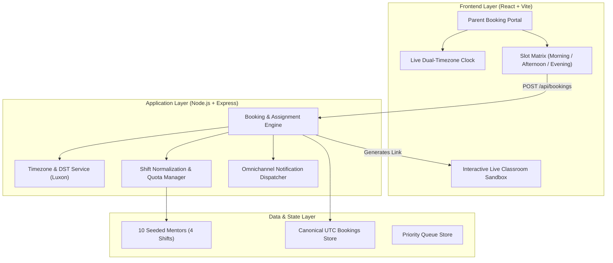

# Codeyoung 1:1 Trial Class Appointment Booking System

[](https://kodaverse-863ce.web.app/)
[](https://github.com/DeekshaG96/codeyoung-trial-booking)
[](https://github.com/DeekshaG96/codeyoung-trial-booking)
[](https://github.com/DeekshaG96/codeyoung-trial-booking)
[](https://nodejs.org/)
[](LICENSE)

An enterprise-grade, full-stack appointment scheduling platform engineered for **Codeyoung**. The system enables international parents (primarily across the United States and the United Kingdom) to seamlessly book 1:1 trial coding sessions with India-based mentors with complete timezone synchronization, Daylight Saving Time (DST) handling, and mentor daily workload protection.

---

## Table of Contents

- [Executive Summary](#executive-summary)
- [System Requirements & Compliance](#system-requirements--compliance)
- [System Architecture](#system-architecture)
  - [Cross-Timezone & DST Synchronization Engine](#cross-timezone--dst-synchronization-engine)
  - [Operational Shift Boundary Normalization](#operational-shift-boundary-normalization)
  - [Mentor Load-Balancing & Capacity Enforcement](#mentor-load-balancing--capacity-enforcement)
- [Repository Structure](#repository-structure)
- [Environment Configuration](#environment-configuration)
- [Setup & Local Execution](#setup--local-execution)
- [Automated Testing Suite](#automated-testing-suite)
- [Cloud Drive MVP](#cloud-drive-mvp)
- [RESTful API Specification](#restful-api-specification)
- [Deployment Architecture](#deployment-architecture)
- [License](#license)

---

## Executive Summary

At Codeyoung, parents evaluate coaching quality by booking a 1:1 "trial class" for their children in disciplines such as Scratch, Python & AI, Web Development, and Robotics. 

This platform solves the operational and technical challenges of cross-continental scheduling:
1. **Mathematical Equilibrium:** 10 available mentors with a strict upper limit of 2 demos per day provides an exact daily system capacity of 20 trial classes, precisely matching the daily target of 20 prospective parents.
2. **Global Temporal Alignment:** Bridging US (EDT/CDT/MDT/PDT) and UK (BST/GMT) parent wall-clock times with India Standard Time (IST, UTC+05:30) while accounting for asymmetric Daylight Saving Time transitions.
3. **End-to-End Trial Journey:** Immediate mentor assignment, localized confirmation emails, RFC 5545 `.ics` calendar generation, and an interactive virtual classroom dummy meeting environment.

---

## System Requirements & Compliance

The implementation addresses all explicit engineering constraints outlined in the technical specification:

| Requirement | Implementation Architecture | Verification Method |
|---|---|---|
| **10 Mentors Available** | Seeded with 10 verified STEM mentors categorized into 4 operational shifts in IST. | `GET /api/mentors` endpoint & automated tests |
| **20 Parents / Day Capacity** | Strict mathematical equilibrium ($10 \times 2 = 20$). Prevents overbooking across all shifts. | 20-Parent batch simulation engine |
| **Parent Local Time Display** | Automatic browser timezone detection with manual selector. Displays dual parent/mentor times. | Live real-time dual synchronizer clocks |
| **Daylight Saving Time (DST)** | Dynamic offset calculation using compiled IANA tz databases via Luxon. No hardcoded UTC offsets. | 8 dedicated unit tests (23h spring-forward, 25h fall-back) |
| **Mentor Cap: Max 2 Demos/Day** | Hard quota validation per mentor per operational shift date. Load-balances across 0-demo mentors first. | Unit tests in `bookingService.test.js` |
| **Working Dummy Class Link** | Generates unique meeting URLs (`/demo/:id`) opening a fully functional interactive coding sandbox. | Browser testing & sandbox unit tests |
| **Empathetic Error Handling** | If all mentors or requested slots are exhausted, returns the 3 nearest alternate slots + waitlist. | Fallback test cases & UI modal validation |
| **AI Session Transparency** | Full prompts, architectural decisions, and tool executions recorded in `TRANSCRIPT.md`. | Included in repository root |

---

## System Architecture



### Cross-Timezone & DST Synchronization Engine

1. **Canonical UTC Invariant:** All appointment start and end times are stored in ISO-8601 UTC (`YYYY-MM-DDTHH:mm:ss.sssZ`).
2. **Asymmetric Daylight Saving Time:**
   - India Standard Time (`Asia/Kolkata`) does **not** observe DST and remains permanently fixed at UTC+05:30.
   - United States and United Kingdom timezones advance clocks forward by 1 hour in spring (23-hour calendar day) and backward by 1 hour in autumn (25-hour calendar day).
   - Hardcoded offsets (e.g., assuming IST is always EST + 10.5 hours) fail during DST shifts. The engine queries the IANA database at runtime to detect `isInDST` and apply the exact active offset.

### Operational Shift Boundary Normalization

A fundamental edge case occurs when mentors in India work US evening shifts (e.g., 18:00 to 03:00 IST):
- An appointment booked at **5:00 PM EDT on Saturday** corresponds to **02:30 AM IST on Sunday**.
- If daily demo caps were calculated by local calendar day in India, an educator working overnight could be assigned 2 sessions before midnight (Saturday) and 2 sessions after midnight (Sunday), resulting in 4 sessions within a single work shift.
- To maintain the strict limit of 2 demos per day, the engine implements `getOperationalShiftDate()`: sessions taking place between `00:00` and `07:00 IST` are normalized to the **calendar date when that work shift commenced**.

### Mentor Load-Balancing & Capacity Enforcement

When a parent selects an available slot:
1. The engine identifies all mentors qualified for the selected subject whose operational shift covers the requested UTC interval.
2. It filters out mentors who have an existing booking overlapping with the slot.
3. It checks the mentor's operational shift quota (`demosBookedToday < 2`).
4. **Load Balancing:** Among eligible mentors, assignment priority is given to mentors with **0 bookings today**, followed by mentors with **1 booking today**, distributing the workload evenly.

---

## Repository Structure

```text
codeyoung-trial-booking/
├── .env.example                     # Environment template for frontend and backend
├── README.md                        # Formal system documentation
├── TRANSCRIPT.md                    # Complete AI development transcript
├── package.json                     # Root monorepo workspace configuration
├── vercel.json                      # Vercel serverless deployment specification
├── firebase.json                    # Firebase hosting deployment configuration
├── api/
│   └── index.js                     # Serverless Express wrapper for Vercel
├── client/                          # Frontend Application (React, Vite)
│   ├── index.html                   # HTML entry point with modern typography
│   ├── package.json                 # Client dependencies
│   ├── vite.config.js               # Vite build configuration
│   └── src/
│       ├── App.jsx                  # Root component with navigation routing
│       ├── index.css                # Standardized CSS design system & mobile styles
│       ├── components/              # Modular UI components
│       │   ├── Navbar.jsx           # Portal navigation header
│       │   ├── BookingWizard.jsx    # 3-step parent booking wizard
│       │   ├── ChildSubjectStep.jsx # Child details and subject selection
│       │   ├── SlotPickerStep.jsx   # Timezone selector & dynamic slot grid
│       │   ├── ParentFormStep.jsx   # Contact submission & summary review
│       │   ├── BookingSuccess.jsx   # Confirmation, meeting link & .ics export
│       │   ├── MentorOverview.jsx   # 10-mentor operations dashboard
│       │   ├── VirtualClassroom.jsx # Live 1:1 demo class sandbox
│       │   ├── SimulationRunner.jsx # Automated 20-parent batch test
│       │   └── EmailModal.jsx       # Dispatch log inspector
│       └── services/
│           ├── api.js               # API client with fallback resilience
│           └── localDataEngine.js   # Isomorphic offline state engine
└── server/                          # Backend Application (Node.js, Express)
    ├── package.json                 # Server dependencies & Vitest configuration
    └── src/
        ├── index.js                 # Express server bootstrap & middleware
        ├── config/
        │   └── timezones.js         # Supported IANA timezones & DST metadata
        ├── data/
        │   ├── mentorsData.js       # 10 seeded mentors across 4 shifts
        │   └── store.js             # Thread-safe in-memory state store
        ├── routes/                  # RESTful API route definitions
        │   ├── bookingRoutes.js     # Slot querying & appointment booking
        │   ├── mentorRoutes.js      # Mentor availability & schedules
        │   ├── timezoneRoutes.js    # Timezone discovery endpoints
        │   └── simulationRoutes.js  # 20-parent stress testing routes
        ├── services/
        │   ├── bookingService.js    # Core allocation, cap & collision engine
        │   ├── timezoneService.js   # Slot generator & RFC 5545 iCalendar builder
        │   └── simulationService.js # 20-parent batch generation logic
        └── tests/                   # Vitest automated test suite
            ├── dst.test.js          # 8 DST boundary & offset test cases
            ├── bookingService.test.js # 7 booking & capacity test cases
            ├── capacityAndSimulation.test.js # 3 stress test cases
            ├── timezoneService.test.js # 5 slot generation & .ics tests
            └── aiAndCodeSandbox.test.js # 5 sandbox execution tests
```

---

## Environment Configuration

The repository includes a template file [`.env.example`](file:///.env.example) documenting all configurable parameters:

### Client Configuration (`client/.env`)

| Variable | Type | Default Value | Description |
|---|---|---|---|
| `VITE_API_URL` | String | `/api` | Base path or URL for backend API requests |
| `VITE_FIREBASE_API_KEY` | String | *Configured* | Firebase client API key |
| `VITE_FIREBASE_PROJECT_ID` | String | `kodaverse-863ce` | Firebase project identifier |
| `VITE_GEMINI_API_KEY` | String | *(Optional)* | Google Gemini API key for live AI assistant |

### Server Configuration (`server/.env`)

| Variable | Type | Default Value | Description |
|---|---|---|---|
| `PORT` | Integer | `5001` | Local HTTP port for the Express server |
| `NODE_ENV` | String | `development` | Runtime environment (`development` / `production`) |
| `CLIENT_ORIGIN` | String | `http://localhost:3000` | Allowed CORS origins (comma-separated) |
| `MAX_DAILY_DEMOS_PER_MENTOR` | Integer | `2` | Hard quota cap for trial sessions per mentor per day |
| `MENTOR_TIMEZONE` | String | `Asia/Kolkata` | Canonical base timezone for mentor operations |

---

## Setup & Local Execution

### Prerequisites
- **Node.js:** `>= 18.0.0`
- **npm:** `>= 9.0.0`

### 1. Clone the Repository
```bash
git clone https://github.com/DeekshaG96/codeyoung-trial-booking.git
cd codeyoung-trial-booking
```

### 2. Install Dependencies
Install dependencies across the monorepo root, client, and server in a single command:
```bash
npm run install:all
```

### 3. Run in Development Mode
Start both the Express backend (`http://localhost:5001`) and Vite client (`http://localhost:3000`) concurrently:
```bash
npm run dev
```
Open **`http://localhost:3000`** in any web browser.

### 4. Run Automated Unit Tests
Execute the complete Vitest test suite:
```bash
npm test
```

### 5. Build for Production
Compile the client application into production-optimized assets:
```bash
npm run build
```

---

## Automated Testing Suite

The application is validated by **28 automated tests across 5 test suites** using [Vitest](https://vitest.dev/):

```text
 RUN  v2.1.9 server/src/tests

 ✓ src/tests/dst.test.js (8 tests)
   ✓ US Spring-Forward (March 8, 2026) is a 23-hour day in UTC
   ✓ UK Spring-Forward (March 29, 2026) is a 23-hour day in UTC
   ✓ US Fall-Back (November 1, 2026) is a 25-hour day in UTC
   ✓ UK Fall-Back (October 25, 2026) is a 25-hour day in UTC
   ✓ India (Asia/Kolkata) has no DST and is always 24 hours
   ✓ Fixed IST mentor instant shifts clock hour in New York across DST boundary
   ✓ formatDstIndicator detects DST in summer vs standard in winter
   ✓ Luxon formats offset with GMT/UTC and minute precision

 ✓ src/tests/bookingService.test.js (7 tests)
   ✓ Validates mandatory fields and throws error on missing data
   ✓ Creates booking with dummy link meeting URL
   ✓ Enforces strict 2-demo daily cap per mentor
   ✓ Load balances by prioritizing mentor with 0 demos over 1 demo
   ✓ Avoids overlapping bookings for the same mentor
   ✓ Returns empathetic error with alternative slots when fully booked
   ✓ Allows priority waitlist submission

 ✓ src/tests/capacityAndSimulation.test.js (3 tests)
   ✓ Exactly 20 parents can book without exceeding the 2-demo daily limit
   ✓ 21st parent booking is rejected as capacity overflow
   ✓ Midnight boundary normalization groups 00:00-07:00 IST to shift date

 ✓ src/tests/timezoneService.test.js (5 tests)
   ✓ Generates available prospective slots in parent local timezone
   ✓ Filters slots by subject specialization
   ✓ Converts local slot back to ISO UTC accurately
   ✓ Formats RFC 5545 .ics iCalendar export with correct UTC timestamps
   ✓ Lists all supported timezones with valid IANA identifiers

 ✓ src/tests/aiAndCodeSandbox.test.js (5 tests)
   ✓ Correctly executes Python variables and f-string printing
   ✓ Detects syntax error when colon is missing after function or loop
   ✓ Autofixes missing colons in Python statements
   ✓ Autofixes single = to == in conditionals
   ✓ Detects and balances unclosed parentheses

 Test Files  5 passed (5)
      Tests  28 passed (28)
   Duration  1.10s
```

---

## Cloud Drive MVP

The portal includes a Google Drive-style **Cloud Drive** workspace in the main navigation. It supports responsive grid/list views, folder navigation and creation, search, multi-file upload, rename/delete actions, storage usage feedback, and loading/empty/error states. The client calls `/api/storage/*` when the Express API is available and falls back to `client/src/services/storageService.js`, which persists demo metadata in browser `localStorage`. This service boundary can later be replaced with PostgreSQL/S3 without changing the dashboard UI.

Storage endpoints:

- `GET /api/storage/items?parentId=<id>`
- `POST /api/storage/folders`
- `POST /api/storage/files`
- `PATCH /api/storage/items/:id`
- `DELETE /api/storage/items/:id`

---

## RESTful API Specification

### Base URL: `/api`

| Method | Endpoint | Query / Body Schema | Response Status | Description |
|---|---|---|---|---|
| `GET` | `/health` | None | `200 OK` | System health check, mentor count, and service status |
| `GET` | `/timezones` | None | `200 OK` | List of supported IANA timezones with live DST flags |
| `GET` | `/available-slots` | `?timezone=America/New_York&date=2026-10-15&subject=Python` | `200 OK` | Computes available slots with dual-time metadata |
| `POST` | `/bookings` | `{"parentName", "parentEmail", "childName", "childAge", "subject", "slotUtc", "parentTimezone"}` | `201 Created` / `409 Conflict` | Assigns mentor, enforces 2-demo cap, generates meeting URL |
| `GET` | `/bookings` | None | `200 OK` | Lists all active confirmed bookings |
| `GET` | `/bookings/:id` | None | `200 OK` / `404 Not Found` | Retrieves booking details by reference ID |
| `GET` | `/bookings/:id/calendar.ics` | None | `200 OK` (`text/calendar`) | Exports standard RFC 5545 iCalendar file |
| `GET` | `/storage/items` | `?parentId=<id>` | `200 OK` | Lists files and folders in a drive location |
| `POST` | `/storage/folders` | `{"name", "parentId"}` | `201 Created` | Creates a folder |
| `POST` | `/storage/files` | `{"name", "size", "type", "parentId"}` | `201 Created` | Creates file metadata for an uploaded client file |
| `PATCH` | `/storage/items/:id` | `{"name"}` | `200 OK` | Renames a file or folder |
| `DELETE` | `/storage/items/:id` | None | `200 OK` | Removes an item and nested children |
| `POST` | `/bookings/waitlist` | `{"parentName", "parentEmail", "requestedSlot", "timezone"}` | `201 Created` | Registers parent into priority waitlist |
| `GET` | `/mentors` | `?date=2026-10-15` | `200 OK` | Returns 10 mentors with daily quota meter (`booked / 2`) |
| `GET` | `/mentors/:id/schedule` | `?date=2026-10-15` | `200 OK` | Day schedule for a specific mentor in IST |
| `POST` | `/simulate/20-parents` | `{"date": "2026-10-15", "count": 20}` | `200 OK` | Executes automated 20-parent stress test |
| `POST` | `/reset-data` | None | `200 OK` | Resets state store to initial baseline state |

---

## Deployment Architecture

The system is deployed on a dual cloud infrastructure for high availability:

1. **Primary Frontend Deployment (Firebase Hosting):**
   - **URL:** [https://kodaverse-863ce.web.app](https://kodaverse-863ce.web.app/)
   - Optimized static assets served via global Google Cloud CDN edges with Brotli compression.
   - Configured with SPA rewrite routing rules in `firebase.json`.

2. **Full-Stack & Serverless API Mirror (Vercel):**
   - **URL:** [https://codeyoung-trial-booking-lime.vercel.app](https://codeyoung-trial-booking-lime.vercel.app/)
   - The Express application runs as a serverless function (`api/index.js`) handling dynamic booking and timezone operations.
   - **Health Endpoint:** [https://codeyoung-trial-booking-lime.vercel.app/api/health](https://codeyoung-trial-booking-lime.vercel.app/api/health)

---

## License

This project is licensed under the MIT License — see the [LICENSE](LICENSE) file for details.
