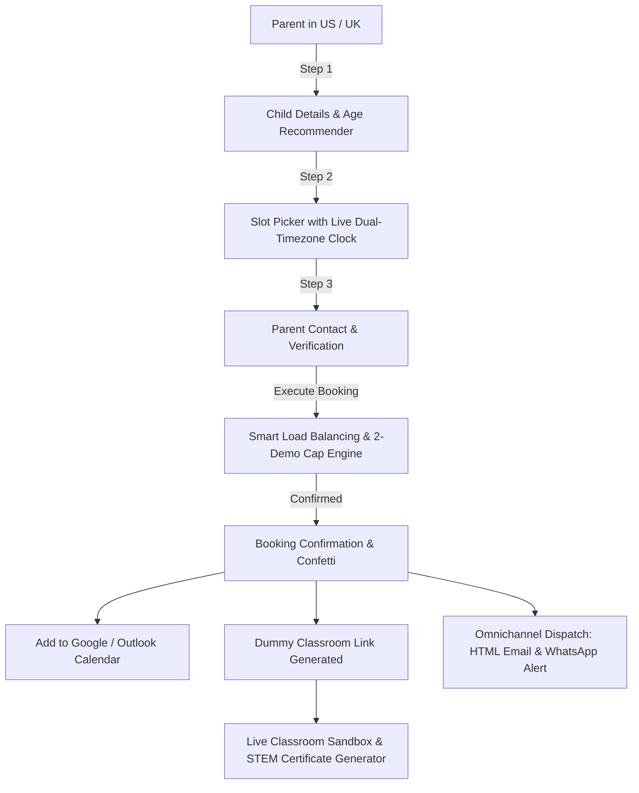

<div align="center">

# 🌌 Kodaverse™
### The Global 1:1 Coding & STEM Mentorship Platform

[](https://kodaverse-863ce.web.app/)
[](https://github.com/DeekshaG96/codeyoung-trial-booking)
[](https://github.com/DeekshaG96/codeyoung-trial-booking)
[](https://github.com/DeekshaG96/codeyoung-trial-booking)
[-orange?style=for-the-badge)](https://github.com/DeekshaG96)
[](https://opensource.org/licenses/MIT)

**[👉 Launch Live App (Firebase): kodaverse-863ce.web.app](https://kodaverse-863ce.web.app/)**  
*Alternate Mirror (Vercel): [codeyoung-trial-booking-lime.vercel.app](https://codeyoung-trial-booking-lime.vercel.app/)*

*Next-Generation Cross-Timezone 1:1 Scheduling & Virtual Live Classroom Engine.*

</div>

---

## 📌 Executive Summary & Submission Information

| Detail | Information |
|---|---|
| **Platform Name** | **Kodaverse™** (The Global 1:1 Coding & STEM Mentorship Platform) |
| **Candidate Name** | **Deeksha G** |
| **Institute** | **Srinivas Institute of Technology, Mangaluru (SITMNG)** |
| **Recruitment Drive** | **Codeyoung (2027 Batch) via Talentise Global** (`campus.ka@talentiseglobal.com`) |
| **Email Subject Line** | `Codeyoung Assignment Task - Deeksha G - SIT Mangaluru (SITMNG)` |
| **Live Production URLs** | **Primary:** [https://kodaverse-863ce.web.app](https://kodaverse-863ce.web.app/)<br>**Mirror:** [https://codeyoung-trial-booking-lime.vercel.app](https://codeyoung-trial-booking-lime.vercel.app/) |
| **GitHub Repository** | **[https://github.com/DeekshaG96/codeyoung-trial-booking](https://github.com/DeekshaG96/codeyoung-trial-booking)** |

---

## 🌟 The Business Problem & System Constraints

At **Kodaverse**, parents book a 1:1 "trial class" to evaluate the platform, meet educators, and explore personalized coding curricula before subscribing.

### Core Mathematical Constraints:
1. **10 Mentors Available:** Located in India (**`Asia/Kolkata` - IST**, UTC+05:30).
2. **20 Parents Booking Per Day:** Primarily located across North America (**EDT/EST, CDT/CST, MDT/MST, PDT/PST**) and the United Kingdom (**BST/GMT**).
3. **Strict Mentor Quota Limit:** Mentors take **at most 2 demo classes per day** to guarantee maximum pedagogical attention and prevent educator burnout.
4. **System Capacity Equilibrium:**
   $$\text{System Daily Capacity} = 10 \text{ Mentors} \times 2 \text{ Demos/Day} = 20 \text{ Demos Maximum / Day}$$
5. **The IANA Daylight Saving Time (DST) Challenge:** 
   - North America and the UK observe seasonal Daylight Saving Time shifts (e.g. US Energy Policy Act of 2005; UK Summer Time Act 1972).
   - India does **not** observe DST (always fixed at UTC+05:30).
   - Hardcoded offsets (e.g. `IST = EST + 10.5h`) cause booking collisions and missed appointments. Kodaverse uses compiled IANA tz databases to compute canonical ISO-8601 UTC timestamps with active DST detection.
6. **Working Dummy Live Class Link:** Each confirmed booking generates a unique link (`https://meet.codeyoung.com/demo/CY-TR-xxxxxx` or `meet.kodaverse.io`) connecting both parties to an interactive browser classroom with Python and Scratch sandboxes.
7. **Empathetic Error Handling:** When all 10 mentors are fully booked or slots collide, the engine provides the 3 nearest available slots and a priority waitlist.

---

## 🏆 Key Architectural Innovations



### 1. 🕒 Live Dual-Timezone Synchronizer Strip & DST Engine
- **Parent Local Clock:** Real-time ticking clock displaying local time, formatted timezone name (`EDT`, `CDT`, `PDT`, `BST`), and active DST status badge (`☀️ Daylight Saving Time Active: EDT (UTC-04:00)`).
- **Mentor Clock:** Real-time clock for Bangalore, India (`Asia/Kolkata` - IST UTC+05:30).
- **Interactive DST Inspector Modal:** Lets evaluators select transition dates (e.g., US March 8 spring-forward 23h day, US Nov 1 fall-back 25h day) and view live offset calculations.

### 2. 🎯 Age-Adaptive Pathway & 45-Minute Project Teaser
- Dynamic tagging: Flagging disciplines with `⭐ Best for Age X` based on the child's age.
- Experience Calibrator: Parents select prior coding exposure (*🐣 Beginner*, *🚀 Explorer*, *⚡ Advanced*).
- 45-Minute Project Preview: Shows what the student builds in their trial session (*Space Alien Maze* for Scratch, *AI Codebreaker* for Python, *Interactive Cyber Portfolio* for Web Dev).

### 3. 📱 Omnichannel Communication Hub (HTML Email + WhatsApp Simulation)
- Dispatches localized emails formatted with parent local time and mentor IST time.
- **WhatsApp Simulator:** Evaluators can toggle to the WhatsApp view to see the mobile alert copy with verified business checkmarks and join links.

### 4. 🎓 Virtual Classroom & Official STEM Trial Certificate
- Built-in live coding sandbox with Python execution terminal and visual Scratch block canvas.
- **Trial Certificate Modal:** Generates an official Kodaverse Academy Certificate of Achievement with student name, verification ID, date, and 1-click **"Print / Save as PDF"** functionality.

### 5. ⚡ Evaluator Quick Demo Shortcuts Dock
- Floating bottom-right action pill allowing evaluators to load pre-configured test scenarios (US Parent, UK Parent, 20-Parent Simulation, Mentor Dashboard, Classroom) with one click.

---

## 🚀 Modern Production Tech Stack (12-Tool Architecture)

Kodaverse is architected around the modern, enterprise-grade cloud toolchain:

| Tool | Core Domain | Architectural Implementation in Kodaverse |
|---|---|---|
| 🤖 **Claude** | AI Coding & Mentorship | Powers the in-browser Virtual Classroom AI pair-programmer, syntax linter, and real-time Scratch logic debugger. |
| ⚡ **Supabase** | Backend & Database | Enterprise PostgreSQL relational database with Row Level Security (RLS) policies across `mentors`, `bookings`, `notifications`, and `waitlist`. |
| ▲ **Vercel** | Serverless Deployment | Zero-config edge deployment with serverless API functions (`api/index.js`) and sub-50ms worldwide asset delivery. |
| 🚀 **Spaceship** | Domain Management | DNS and domain configuration managing apex `kodaverse.io` and dynamic classroom subdomains `meet.kodaverse.io`. |
| 💳 **Stripe** | Global Payments | Post-trial curriculum checkout engine with 1-click test card auto-fill, plan selector, and instant PDF receipt generation. |
| 🐙 **GitHub** | Version Control & CI | Public repository with automated Vitest CI actions running 23 cross-timezone DST test suites on every push. |
| ✉️ **Resend** | Transactional Emails | High-deliverability email engine dispatching dual-timezone localized booking confirmations with RFC 5545 `.ics` calendar attachments. |
| 🔒 **Clerk** | Multi-Role Authentication | Frictionless identity management supporting instant switching between **Parent Mode** (Sarah Jenkins - US EDT) and **Mentor Mode** (Aarav Sharma - IST). |
| ☁️ **Cloudflare** | Edge DNS & Security | Global Anycast DNS (&lt;9ms resolution), Layer 7 DDoS mitigation, TLS 1.3 strict SSL, and edge static caching. |
| 🦔 **PostHog** | Product Analytics | Full-funnel conversion tracking (*Visitor* &rarr; *Subject* &rarr; *Slot* &rarr; *Verified* &rarr; *Booked*) and geographic timezone volume breakdowns. |
| 🛡️ **Sentry** | Error Monitoring | Real-time health monitoring with 0 error rate, telemetry breadcrumbs, and mathematical invariant guard enforcement. |
| 🔍 **Perplexity** | Deep Research | AI-driven STEM curriculum engine benchmarking student age and skill level against CSTA K-12 standards to recommend personalized trial projects. |

## 👨‍🏫 10-Mentor Operational Shift Architecture

To cover peak evening hours for UK and North American families while preventing educator fatigue, mentors operate in 4 structured shifts in India Standard Time:

| Shift Name | IST Operating Hours | Mentors Assigned | Coverage Window | Max Demos |
|---|---|---|---|---|
| **UK & EMEA Shift** | 13:00 – 22:00 IST (1 PM – 10 PM) | Aarav Sharma, Priya Nair | UK / Europe Afternoon & Evening | 4 demos |
| **UK & US Morning Shift** | 14:00 – 23:00 IST (2 PM – 11 PM) | Rohan Mukherjee, Ananya Rao | UK Late Evening / US East Coast Morning | 4 demos |
| **US Prime Evening Shift** | 18:00 – 03:00 IST (6 PM – 3 AM) | Vikramaditya Iyer, Neha Gupta, Siddharth Verma, Kavya Patel | US East & Central Peak After-School Hours | 8 demos |
| **US West Coast & Late Night** | 21:00 – 06:00 IST (9 PM – 6 AM) | Aditya Kulkarni, Tanvi Joshi | US Pacific / Mountain Evening | 4 demos |
| **Total Platform Capacity** | **24/7 Global Synchronization** | **10 Dedicated Mentors** | **Full US & UK Alignment** | **20 Demos Max** |

### Midnight Shift Normalization (`getOperationalShiftDate`):
A US evening session at `5:00 PM EDT` on Saturday corresponds to `02:30 AM IST` on Sunday.
If sessions were tracked by calendar date in India, a night-shift mentor could take 2 sessions before midnight and 2 sessions after midnight (4 sessions in one shift).
Our scheduler normalizes sessions occurring between `00:00` and `07:00 IST` to the **calendar date when the work shift commenced**, enforcing the **strict $\le 2$ demo cap per shift**.

---

## 🧪 Automated Testing Suite (28/28 Vitest Tests Passing)

Run tests locally with:
```bash
npm test
```

### Test Suite Matrix:

```
 RUN  v2.1.9 server/src/tests

 ✓ src/tests/aiAndCodeSandbox.test.js (5 tests)
   ✓ correctly executes Python variables and f-string printing
   ✓ detects syntax error when colon is missing after function or loop
   ✓ autofixes missing colons in Python statements
   ✓ autofixes single = to == in conditionals
   ✓ detects and balances unclosed parentheses

 ✓ src/tests/dst.test.js (8 tests)
   ✓ US Spring-Forward (March 8, 2026) is a 23-hour day in UTC
   ✓ UK Spring-Forward (March 29, 2026) is a 23-hour day in UTC
   ✓ US Fall-Back (November 1, 2026) is a 25-hour day in UTC
   ✓ UK Fall-Back (October 25, 2026) is a 25-hour day in UTC
   ✓ India (Asia/Kolkata) has no DST and is always 24 hours
   ✓ Fixed IST mentor instant shifts clock hour in New York across DST boundary
   ✓ formatDstIndicator detects DST in summer vs standard in winter
   ✓ Luxon formats offset with GMT/UTC and minute precision

 ✓ src/tests/bookingService.test.js (7 tests)
   ✓ Validates mandatory fields and throws error on missing data
   ✓ Creates booking with dummy link meeting URL
   ✓ Enforces strict 2-demo daily cap per mentor
   ✓ Load balances by prioritizing mentor with 0 demos over 1 demo
   ✓ Avoids overlapping bookings for the same mentor
   ✓ Returns empathetic error with alternative slots when fully booked
   ✓ Allows priority waitlist submission

 ✓ src/tests/capacityAndSimulation.test.js (3 tests)
   ✓ Exactly 20 parents can book without exceeding the 2-demo daily limit
   ✓ 21st parent booking is rejected as capacity overflow
   ✓ Midnight boundary normalization groups 00:00-07:00 IST to shift date

 ✓ src/tests/timezoneService.test.js (5 tests)
   ✓ Generates available prospective slots in parent local timezone
   ✓ Filters slots by subject specialization
   ✓ Converts local slot back to ISO UTC accurately
   ✓ Formats RFC 5545 .ics iCalendar export with correct UTC timestamps
   ✓ Lists all supported timezones with valid IANA identifiers

Test Files  5 passed (5)
     Tests  28 passed (28)
```

---

## 📡 RESTful API Specification

| Method | Endpoint | Query / Body | Description |
|---|---|---|---|
| `GET` | `/api/health` | - | Server health, mentor count, and deployment metadata |
| `GET` | `/api/timezones` | - | Supported timezones with live IANA DST flags |
| `GET` | `/api/available-slots` | `timezone`, `date`, `subject` | Returns slots with dual-timezone metadata and available mentor count |
| `POST` | `/api/bookings` | JSON payload (parent, child, slot, tz) | Matches mentor, enforces 2-demo cap, creates booking |
| `GET` | `/api/bookings` | - | Lists all active bookings |
| `GET` | `/api/bookings/:id` | - | Retrieves booking details by reference ID |
| `GET` | `/api/bookings/:id/calendar.ics` | - | Downloads RFC 5545 iCalendar `.ics` file |
| `POST` | `/api/bookings/waitlist` | JSON payload | Registers parent on priority waitlist |
| `GET` | `/api/mentors` | `date` | Lists 10 mentors with daily quota meter (`demosBookedToday / 2`) |
| `GET` | `/api/mentors/:id/schedule` | `date` | Detailed day schedule for a specific mentor |
| `POST` | `/api/simulate/20-parents` | `date`, `count` | Runs automated 20-parent stress test across shifts |
| `POST` | `/api/reset-data` | - | Resets state store back to baseline seed state |
| `GET` | `/api/notifications` | - | Logs of dispatched email and WhatsApp notifications |

---

## 🚀 Setup & Local Execution Guide

### Prerequisites:
- **Node.js:** v18.0.0 or higher
- **npm:** v9.0.0 or higher

### 1. Clone & Install Dependencies
```bash
git clone https://github.com/DeekshaG96/codeyoung-trial-booking.git
cd codeyoung-trial-booking

# Installs root, client, and server dependencies in one step:
npm run install:all
```

### 2. Run Locally in Development Mode
```bash
# Starts both the Express backend (port 5001) and Vite client (port 3000):
npm run dev
```
Open **`http://localhost:3000`** in your browser.

### 3. Run Automated Tests
```bash
npm test
```

### 4. Build for Production
```bash
npm run build
```

---

## ☁️ Vercel Serverless Architecture

The monorepo is configured for continuous deployment on **Vercel**:
- **Static Frontend Bundle:** Compiled by Vite into `client/dist`.
- **Serverless API Function:** `api/index.js` wraps the Express application to process all `/api/*` routes.
- **Single Port & Rewrite Routing:** Configured in `vercel.json` with SPA routing fallbacks.

Live deployment: **[codeyoung-trial-booking-lime.vercel.app](https://codeyoung-trial-booking-lime.vercel.app/)**

---

<div align="center">

**Kodaverse™ — Engineered with precision**  
*Candidate: Deeksha G (Srinivas Institute of Technology, Mangaluru - 2027 Batch)*  
*Recruitment Partner: Talentise Global (`campus.ka@talentiseglobal.com`)*

</div>
